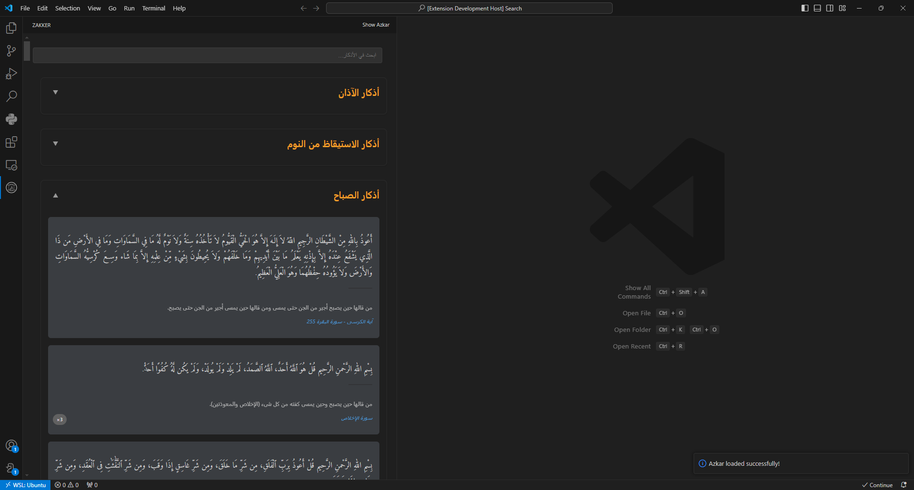

<!-- Plugin description -->
# Zakker

A Visual Studio Code IDE plugin that provides easy access to Islamic remembrances (Azkar) during your coding sessions, helping you stay connected with the words of Allah.

    

## Features

- Daily Azkar: Access a variety of Azkar (Islamic remembrances) to recite during your coding breaks.
- Categorized Azkar: Azkar are organized into different categories for easy navigation.
- Searchable Azkar: Quickly find specific Azkar using the built-in search functionality.
- Convenient Access: Easily access your Azkar without leaving your Visual Studio Code IDE.

## About the Data

The Azkar data used in this plugin is based on the collection curated by [Eng:Osama Younis](https://github.com/osamayy) and available in his [azkar-db repository](https://github.com/osamayy/azkar-db).

## Screenshots

_Viewing the list of available Azkar categories._

## Feedback and Contributions

We welcome your feedback and contributions to improve the Zakker plugin. If you have any suggestions or encounter any issues, please don't hesitate to [create an issue](https://github.com/hadywalied/Zakker-vscode/issues/new) in the project repository.

Happy coding and may the remembrance of Allah be with you!

<!-- Plugin description end -->
